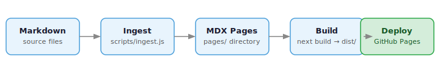

# mdsite

A portable static site generator for markdown — drop it into any CI/CD pipeline as a build step.

## Purpose

`mdsite` is a Next.js + Nextra-based site generator designed to work at the end of a markdown
publishing pipeline. The engine is packaged as a Docker image: mount your content and a YAML
config, get a `dist/` folder. Publishing is left to the caller.

It is also designed to be configured as easily by an AI agent as by a human — a small YAML
config file is all that's required to stand up a new site.

## How It Works

1. Write markdown content in any folder structure
2. Provide an `mdsite.yaml` config pointing at that content
3. Run the CLI or Docker container to ingest and build
4. A fully-built static site appears in your output directory

See [Getting Started](/getting-started) to have a site running in minutes,
or browse the [Features](/features) section for the full capability overview.

## Features

- **Markdown → MDX** — automatic conversion, any folder structure
- **Images** — copied and path-rewritten automatically; corrupt EXIF data stripped
- **Reading time** — estimated and injected into every page's frontmatter
- **Tags and categories** — rendered as pill chips below each title and in the sidebar
- **Sidebar metrics** — any numeric frontmatter field surfaces as a labeled score
- **Nav ordering** — configure page and folder order via `nav_order` in YAML or `order:` in frontmatter
- **Per-page feed** — scroll to the bottom of any page to load the next one inline
- **Theme toggle** — light / dark / system toggle in the navbar
- **GitHub header icon** — circular GitHub repo link, auto-shown from `repo_url`
- **YAML config** — single file drives the entire build
- **Docker** — packaged as a container for use in any CI/CD pipeline

## Roadmap

**Phase 1 — Core engine** *(complete)*
- Next.js + Nextra docs theme
- YAML config + CLI wrapper
- Docker image, GHCR publishing
- GitHub Pages deployment
- Metadata display (tags, chips, sidebar metrics, reading time)
- Per-page continuation feed
- Nav ordering via config and frontmatter

**Phase 2 — Custom components** *(planned)*
- Semantic search integration
- Semantic theming pipeline
- Reduced external dependencies

**Phase 3 — Deploy adapters** *(planned)*
- `mdsite deploy --provider vercel|cloudflare|s3`
- Credentials via environment variables; project ID via YAML
